<div align="center">
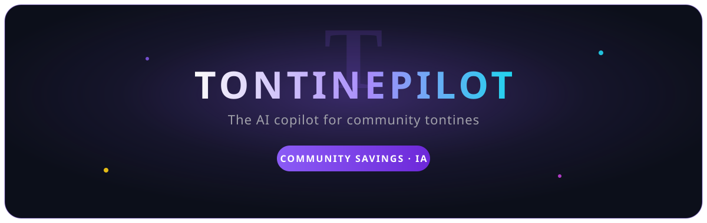

# TontinePilot

[](https://main.dhnfua5oyahpy.amplifyapp.com)
[](https://github.com/khadimmbaye0/tontine-pilot/actions)
[](https://nextjs.org)
[](https://aws.amazon.com/bedrock/)
[](https://docs.amplify.aws)
[](LICENSE)

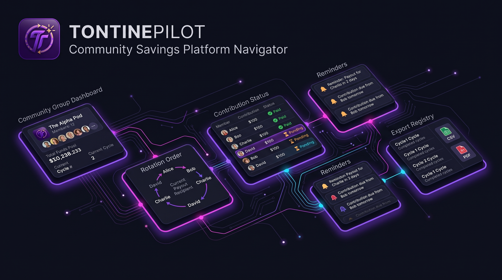

**TontinePilot** is the AI copilot for community rotating savings groups (tontines).
It turns informal declarations and Mobile Money screenshots into a shared,
verifiable ledger — with empathic mediation, an emergency fund, and audio digests.
Built with **Next.js 16** and **AWS Bedrock**, bilingual French/English, designed
for a real tontine admin — not a throwaway demo.

no real money ever moves, tracking only.

</div>

<div align="center">

</div>

## What it does

| Area | Capability |
|---|---|
| Natural-language declarations | "I paid 20000 for Cheikh" → Bedrock extracts amount, member, recipient |
| Mobile Money OCR | Wave / Orange Money / MTN screenshots → amount, transaction ID, date |
| Empathic mediation | Gentle nudges, installment plans, tour swaps, anomaly detection |
| Emergency fund | Tontine Flex reserve that unlocks the recipient on critical lates |
| AI rotation order | Trust − lates + seniority; provisional lottery with no history |
| Audio digest | Cycle summary read aloud (Polly Léa / Joanna), FR/EN, with countdown |
| Tonti assistant | Answers and acts: emails and reminds members in natural language |
| Exportable ledger | CSV + printable preview to end disputes |

<div align="center">

</div>

## Landing

<div align="center">
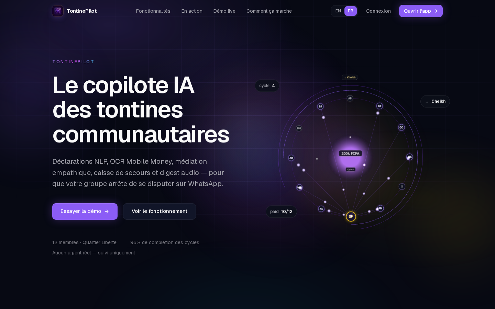
</div>

<details>
<summary><b>Product film, live demo and how it works</b></summary>

<div align="center">
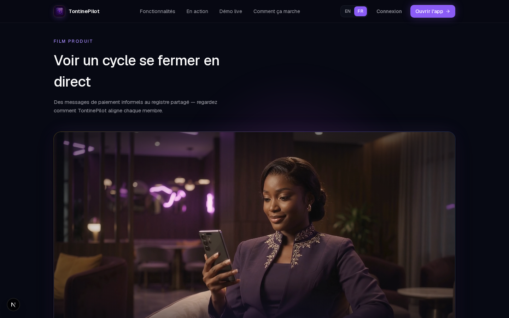
<br><br>
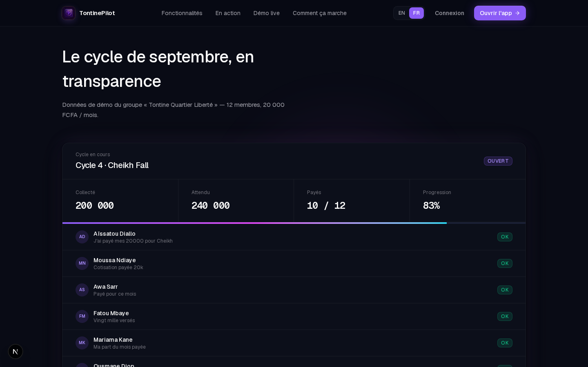
<br><br>
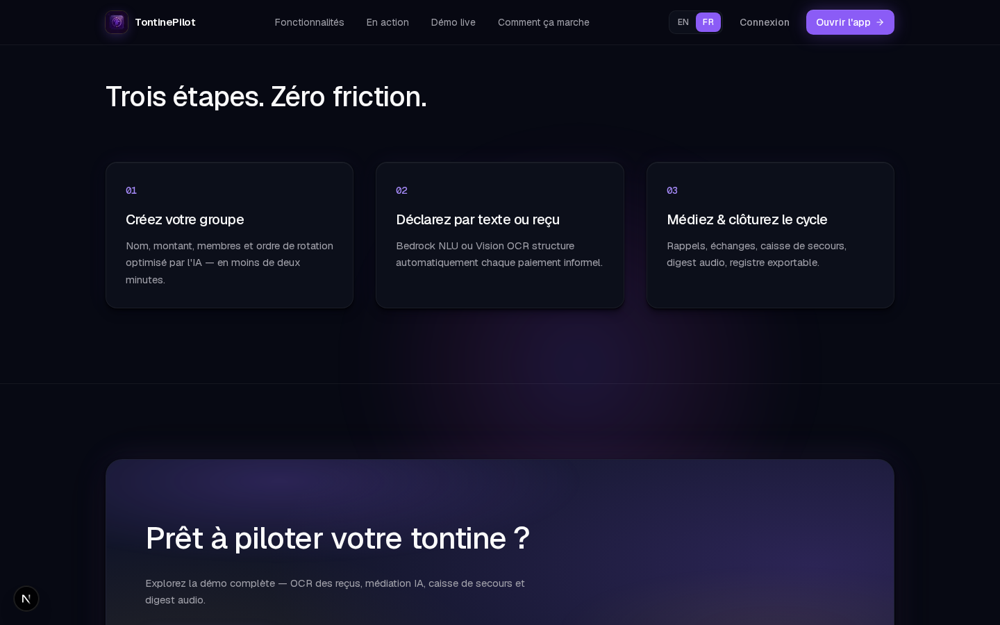
<br><br>
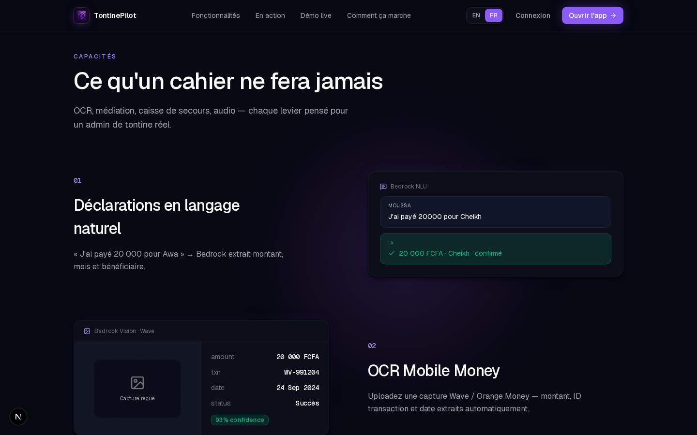
</div>

</details>

<div align="center">

</div>

## The app

<div align="center">
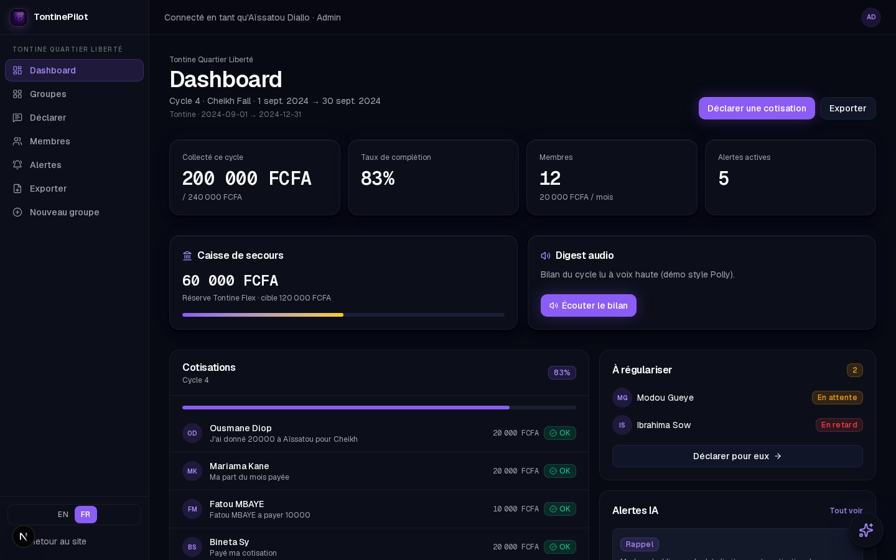
</div>

<details>
<summary><b>Sign in and groups</b></summary>

<div align="center">
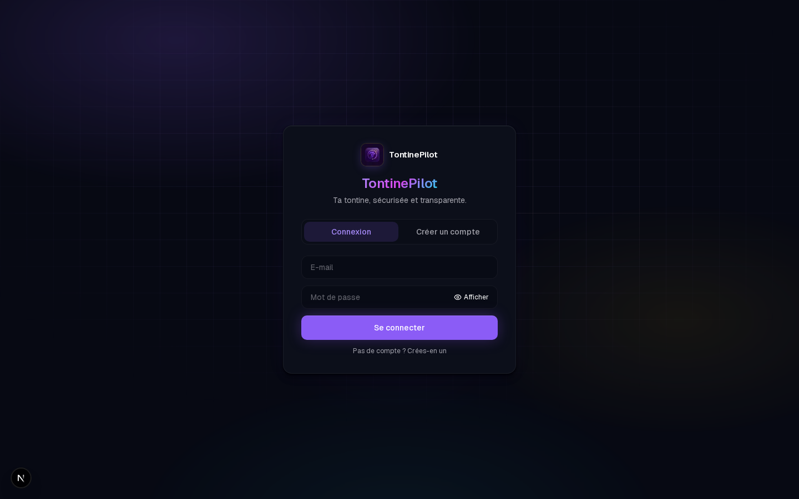
<br><br>
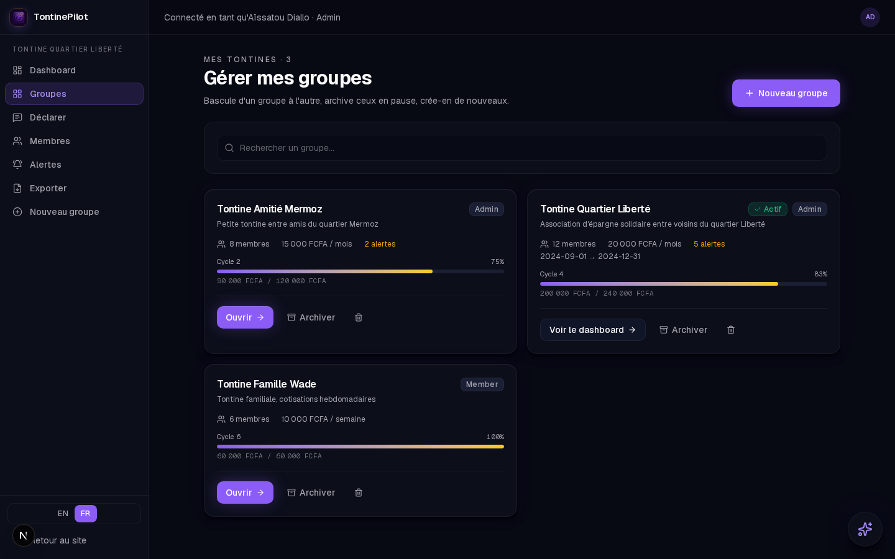
</div>

</details>

<details>
<summary><b>Declare, members and alerts</b></summary>

<div align="center">
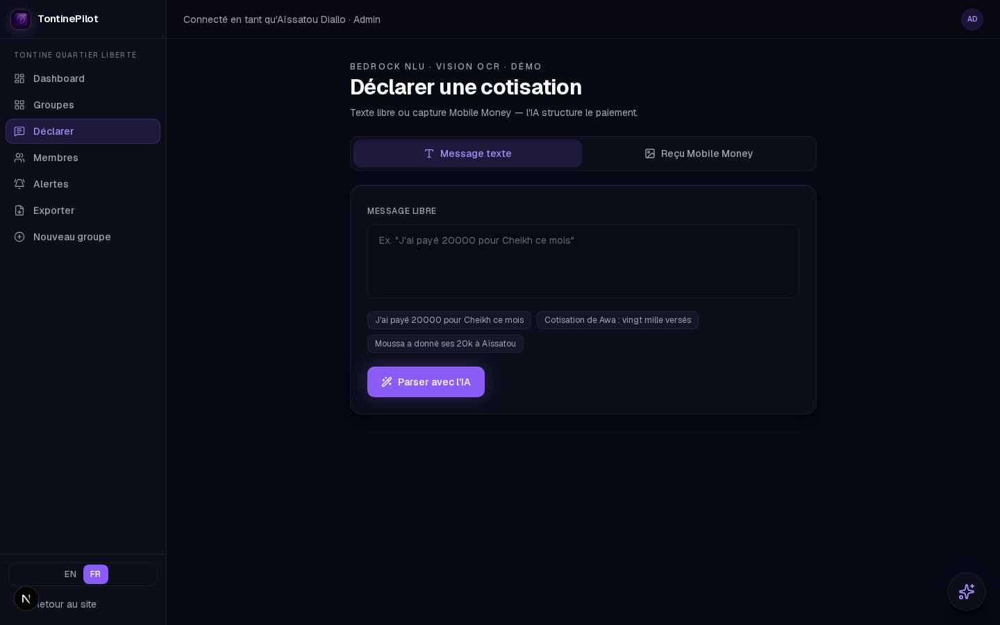
<br><br>
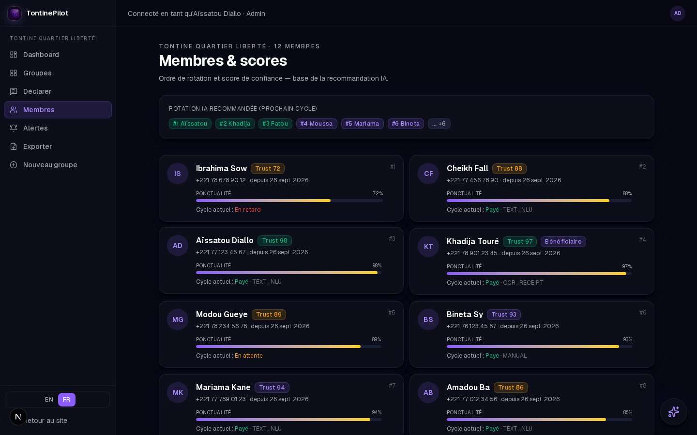
<br><br>
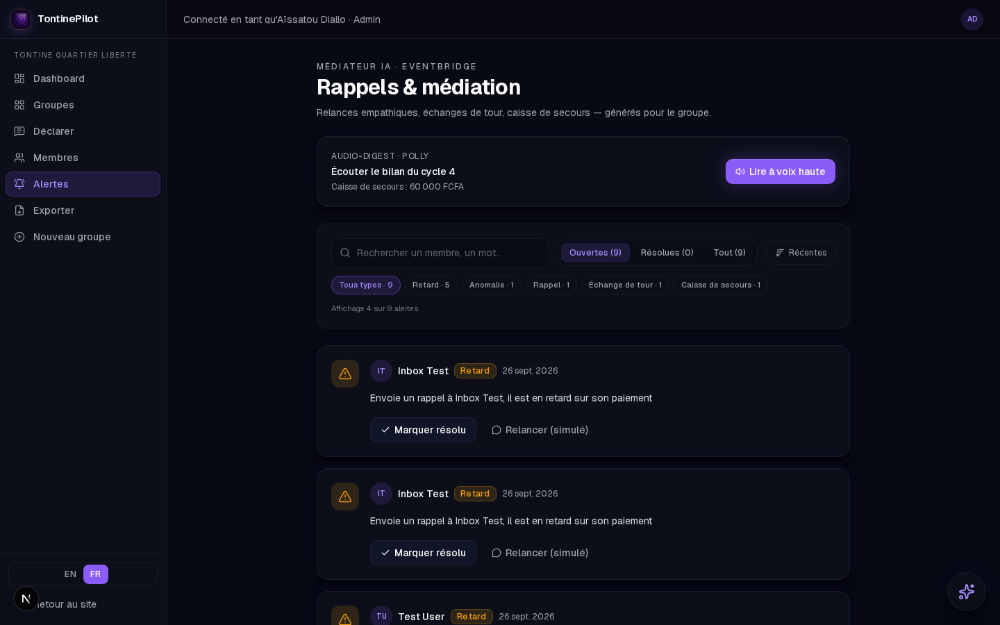
</div>

</details>

<details>
<summary><b>Export and group creation</b></summary>

<div align="center">
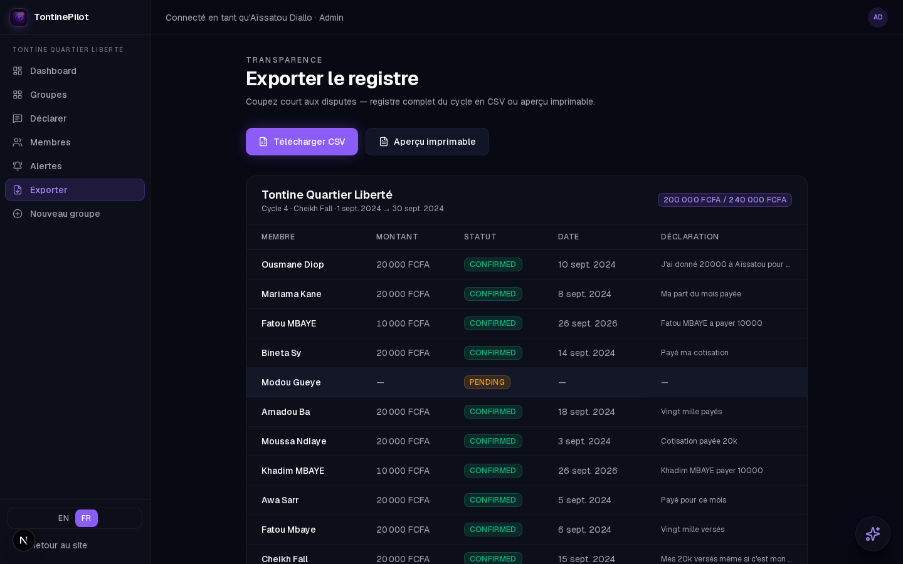
<br><br>
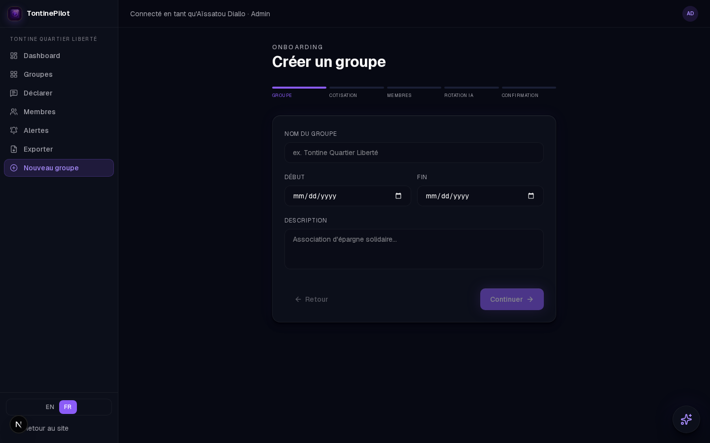
</div>

</details>

<div align="center">

</div>

## Stack

| Layer | Arsenal |
|---|---|
| Frontend | Next.js 16.3.6 · React 19.2.8 · Tailwind CSS 4 · Framer Motion 13.4.4 |
| Backend | Amplify Gen 2 · Cognito · AppSync GraphQL · DynamoDB · Lambda Node 22 · S3 |
| AI | Bedrock Converse: Claude Haiku 4.5 (NLU, mediation, chat) · Sonnet 4.5 (vision) · Polly (Léa, Joanna) · Textract (OCR fallback) |
| Infra | EventBridge Scheduler · SES · SNS · Amplify Hosting · CDK 2.271.0 |
| Quality | Strict TypeScript · Vitest (33 tests) · ESLint · GitHub Actions · Gitleaks |

## Architecture

```mermaid
flowchart TD

subgraph group_client["Web experience"]
  node_auth_ui["Sign-in UI<br/>[auth-card.tsx]"]
  node_app_ui["Group workspace<br/>[page.tsx]"]
  node_declare_ui["Declare payment<br/>[page.tsx]"]
  node_alerts_ui["Alerts and mediation<br/>[page.tsx]"]
  node_export_ui["Ledger export<br/>[page.tsx]"]
  node_assistant_ui["Tonti assistant<br/>[assistant-chat.tsx]"]
end

subgraph group_data["Identity and ledger"]
  node_auth_service["Cognito auth<br/>[resource.ts]"]
  node_remote["Remote data adapter<br/>[remote.ts]"]
  node_api["AppSync data API<br/>[resource.ts]"]
  node_ledger[("Group ledger<br/>[resource.ts]")]
  node_receipt_store[("Receipt and audio storage<br/>[resource.ts]")]
end

subgraph group_workflows["Tontine workflows"]
  node_parse_declaration["Declaration parsing<br/>[handler.ts]"]
  node_parse_receipt["Receipt OCR<br/>[handler.ts]"]
  node_mediate["Empathic mediation<br/>[handler.ts]"]
  node_rotation["Rotation recommendation<br/>[handler.ts]"]
  node_digest["Audio digest<br/>[handler.ts]"]
  node_assistant["Assistant actions<br/>[handler.ts]"]
  node_reminders["Scheduled reminders<br/>[handler.ts]"]
  node_welcome["Group welcome notices<br/>[handler.ts]"]
end

subgraph group_integrations["AI and messaging"]
  node_bedrock{{"Bedrock models"}}
  node_textract{{"Textract OCR"}}
  node_polly{{"Polly speech"}}
  node_email_sms{{"SES and SNS"}}
  node_scheduler["EventBridge Scheduler"]
end

node_member(("Group member"))

node_member -->|"signs in"| node_auth_ui
node_auth_ui -->|"authenticates"| node_auth_service
node_member -->|"uses"| node_app_ui
node_app_ui -->|"requests data"| node_remote
node_declare_ui -->|"submits payment"| node_remote
node_alerts_ui -->|"manages alerts"| node_remote
node_export_ui -->|"requests ledger"| node_remote
node_assistant_ui -->|"asks assistant"| node_api
node_remote -->|"queries and mutates"| node_api
node_api -->|"reads and writes"| node_ledger
node_api -->|"dispatches"| node_parse_declaration
node_api -->|"dispatches"| node_parse_receipt
node_api -->|"dispatches"| node_mediate
node_api -->|"dispatches"| node_rotation
node_api -->|"dispatches"| node_digest
node_api -->|"dispatches"| node_assistant
node_api -->|"dispatches"| node_reminders
node_api -->|"dispatches"| node_welcome
node_parse_declaration -->|"reads context"| node_ledger
node_parse_declaration -->|"extracts details"| node_bedrock
node_parse_receipt -->|"reads group context"| node_ledger
node_parse_receipt -->|"reads receipt"| node_receipt_store
node_parse_receipt -.->|"parses image"| node_bedrock
node_parse_receipt -->|"extracts text"| node_textract
node_mediate -->|"reads alert context"| node_ledger
node_mediate -.->|"drafts proposal"| node_bedrock
node_rotation -->|"reads member history"| node_ledger
node_rotation -.->|"writes reasons"| node_bedrock
node_digest -->|"reads cycle data"| node_ledger
node_digest -.->|"synthesizes speech"| node_polly
node_digest -.->|"stores audio"| node_receipt_store
node_assistant -->|"reads and updates"| node_ledger
node_assistant -->|"answers and routes tools"| node_bedrock
node_assistant -.->|"sends email"| node_email_sms
node_reminders -->|"reads and updates alerts"| node_ledger
node_reminders -.->|"drafts reminder"| node_bedrock
node_reminders -->|"sends reminders"| node_email_sms
node_scheduler -->|"triggers"| node_reminders
node_welcome -->|"reads group members"| node_ledger
node_welcome -->|"sends welcome email"| node_email_sms

click node_auth_ui "https://github.com/khadimmbaye0/tontine-pilot/blob/main/components/auth/auth-card.tsx"
click node_app_ui "https://github.com/khadimmbaye0/tontine-pilot/blob/main/app/(app)/dashboard/page.tsx"
click node_declare_ui "https://github.com/khadimmbaye0/tontine-pilot/blob/main/app/(app)/declare/page.tsx"
click node_alerts_ui "https://github.com/khadimmbaye0/tontine-pilot/blob/main/app/(app)/alerts/page.tsx"
click node_export_ui "https://github.com/khadimmbaye0/tontine-pilot/blob/main/app/(app)/export/page.tsx"
click node_assistant_ui "https://github.com/khadimmbaye0/tontine-pilot/blob/main/components/app/assistant-chat.tsx"
click node_auth_service "https://github.com/khadimmbaye0/tontine-pilot/blob/main/amplify/auth/resource.ts"
click node_remote "https://github.com/khadimmbaye0/tontine-pilot/blob/main/lib/remote.ts"
click node_api "https://github.com/khadimmbaye0/tontine-pilot/blob/main/amplify/data/resource.ts"
click node_ledger "https://github.com/khadimmbaye0/tontine-pilot/blob/main/amplify/data/resource.ts"
click node_receipt_store "https://github.com/khadimmbaye0/tontine-pilot/blob/main/amplify/storage/resource.ts"
click node_parse_declaration "https://github.com/khadimmbaye0/tontine-pilot/blob/main/amplify/functions/parse-declaration/handler.ts"
click node_parse_receipt "https://github.com/khadimmbaye0/tontine-pilot/blob/main/amplify/functions/parse-receipt/handler.ts"
click node_mediate "https://github.com/khadimmbaye0/tontine-pilot/blob/main/amplify/functions/mediate/handler.ts"
click node_rotation "https://github.com/khadimmbaye0/tontine-pilot/blob/main/amplify/functions/recommend-rotation/handler.ts"
click node_digest "https://github.com/khadimmbaye0/tontine-pilot/blob/main/amplify/functions/digest-audio/handler.ts"
click node_assistant "https://github.com/khadimmbaye0/tontine-pilot/blob/main/amplify/functions/assistant/handler.ts"
click node_reminders "https://github.com/khadimmbaye0/tontine-pilot/blob/main/amplify/functions/reminders-worker/handler.ts"
click node_welcome "https://github.com/khadimmbaye0/tontine-pilot/blob/main/amplify/functions/notify/handler.ts"

classDef toneNeutral fill:#f8fafc,stroke:#334155,stroke-width:1.5px,color:#0f172a
classDef toneBlue fill:#dbeafe,stroke:#2563eb,stroke-width:1.5px,color:#172554
classDef toneAmber fill:#fef3c7,stroke:#d97706,stroke-width:1.5px,color:#78350f
classDef toneMint fill:#dcfce7,stroke:#16a34a,stroke-width:1.5px,color:#14532d
classDef toneRose fill:#ffe4e6,stroke:#e11d48,stroke-width:1.5px,color:#881337
classDef toneIndigo fill:#e0e7ff,stroke:#4f46e5,stroke-width:1.5px,color:#312e81
classDef toneTeal fill:#ccfbf1,stroke:#0f766e,stroke-width:1.5px,color:#134e4a
class node_auth_ui,node_app_ui,node_declare_ui,node_alerts_ui,node_export_ui,node_assistant_ui toneBlue
class node_auth_service,node_remote,node_api,node_ledger,node_receipt_store toneAmber
class node_parse_declaration,node_parse_receipt,node_mediate,node_rotation,node_digest,node_assistant,node_reminders,node_welcome toneMint
class node_bedrock,node_textract,node_polly,node_email_sms,node_scheduler toneRose
class node_member toneIndigo
```

Every AI call has a deterministic fallback — the app never hard-fails,
even with zero Bedrock quota.

<div align="center">

</div>

## Quickstart

```bash
git clone github.com:khadimmbaye0/tontine-pilot.git
cd tontine-pilot
npm install && npm run dev   # http://localhost:3101
```

Without a backend it runs on the built-in demo dataset. With `amplify_outputs.json`
(from `npx ampx sandbox`) and an account, it talks to live AWS data:

```bash
npx ampx sandbox --identifier tontine   # dev backend
npx tsx scripts/seed.ts                 # demo dataset (SEED_USER + SEED_PASSWORD)
npx tsx scripts/verify.ts               # 9 live checks
./scripts/deploy-functions.sh [fn...]   # push Lambda code
```

## API

| Operation | Input → Output |
|---|---|
| `parseDeclaration` | text + group → member, amount, recipient, confidence, EN translation |
| `parseReceipt` | S3 key + group → amount, transaction, recipient, date, provider |
| `draftNudge` | alert + locale → FR/EN message + proposal |
| `recommendRotationOp` | group → order, bilingual reasons, provisional flag |
| `buildDigest` | cycle + locale → script + mp3 URL |
| `sendNudge` / `resolveAlert` | alert → send / resolve (dedupeKey anti-doubles) |
| `notifyNewGroup` | group → welcome fan-out `{sent, skipped}` |
| `askAssistant` | question + locale + history → answer (+ member-email tool) |

## Quality

Strict TypeScript across three configs (app, `amplify/`, functions), 33 Vitest tests
(rotation, trust, parsers, intents, adapters), 9 live checks before every ship,
secret scans on every push, end-to-end `docs/` from idea to deployment.

<div align="center">

<br><br>
<b>TontinePilot — the tontine, piloted.</b>
<br><br>
MIT License · AWS Zero to Shipped
</div>
