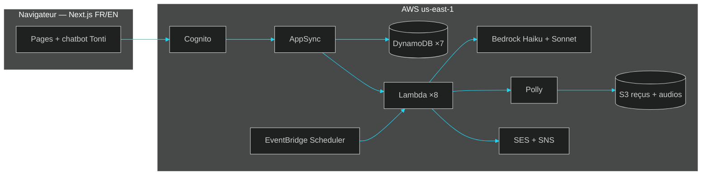

<div align="center">

# TontinePilot

[](https://main.dhnfua5oyahpy.amplifyapp.com)
[](https://github.com/khadimmbaye0/tontine-pilot/actions)
[](LICENSE)
[](https://builder.aws.com)

**TontinePilot** est le copilote IA des tontines communautaires : il transforme les
déclarations informelles et les captures Mobile Money en registre partagé et vérifiable,
avec médiation empathique, caisse de secours et digest audio. Propulsé par
**Next.js 16** et **AWS Bedrock**, bilingue français-anglais, pensé pour un vrai
admin de tontine — pas pour une démo jetable.


**[Ouvrir la démo live](https://main.dhnfua5oyahpy.amplifyapp.com)** · compte démo sur demande ·
aucun argent réel ne transite, suivi uniquement.


</div>

<div align="center">

</div>

## Ce que fait le produit

| Bloc | Super pouvoir |
|---|---|
| Déclarations en langage naturel | « J'ai payé 20000 pour Cheikh » → Bedrock extrait montant, membre, bénéficiaire |
| OCR Mobile Money | Capture Wave / Orange Money / MTN → montant, ID transaction, date |
| Médiation empathique | Relances douces, étalements, échanges de tour, détection d'anomalies |
| Caisse de secours | Réserve Tontine Flex qui débloque le bénéficiaire en cas de retard critique |
| Ordre de rotation IA | Confiance − retards + ancienneté ; tirage provisoire sans historique |
| Digest audio | Bilan lu à voix haute (Polly Léa / Joanna), FR/EN, avec compte à rebours |
| Assistant Tonti | Répond et agit : envoie relances et messages aux membres en langage naturel |
| Registre exportable | CSV + aperçu imprimable pour clore les disputes |

<div align="center">

</div>

## La landing

<div align="center">

</div>

<details>
<summary><b>Voir le film produit, la démo live et le fonctionnement</b></summary>

<div align="center">

<br><br>

<br><br>

<br><br>

</div>

</details>

<div align="center">

</div>

## L'application

<div align="center">

</div>

<details>
<summary><b>Connexion et groupes</b></summary>

<div align="center">

<br><br>

</div>

</details>

<details>
<summary><b>Déclarer, membres et alertes</b></summary>

<div align="center">

<br><br>

<br><br>

</div>

</details>

<details>
<summary><b>Export et création de groupe</b></summary>

<div align="center">

<br><br>

</div>

</details>

<div align="center">

</div>

## La stack

| Couche | Arsenal |
|---|---|
| Front | Next.js 16.3.6 · React 19.2.8 · Tailwind CSS 4 · Framer Motion 13.4.4 |
| Backend | Amplify Gen 2 · Cognito · AppSync GraphQL · DynamoDB · Lambda Node 22 · S3 |
| IA | Bedrock Converse : Claude Haiku 4.5 (NLU, médiation, chat) · Sonnet 4.5 (vision) · Polly (Léa, Joanna) · Textract (secours OCR) |
| Infra | EventBridge Scheduler · SES · SNS · Amplify Hosting · CDK 2.271.0 |
| Qualité | TypeScript strict · Vitest (33 tests) · ESLint · GitHub Actions · Gitleaks |

## L'architecture



Chaque appel IA a un repli déterministe : l'application ne tombe jamais en panne sèche,
même sans quota Bedrock.

<div align="center">

</div>

## Démarrage rapide

```bash
git clone github.com:khadimmbaye0/tontine-pilot.git
cd tontine-pilot
npm install && npm run dev   # http://localhost:3101
```

Sans backend, l'app tourne sur le jeu de démo intégré. Avec `amplify_outputs.json`
(généré par `npx ampx sandbox`) et un compte, elle parle aux vraies données :

```bash
npx ampx sandbox --identifier tontine   # backend de dev
npx tsx scripts/seed.ts                 # jeu de démo (SEED_USER + SEED_PASSWORD)
npx tsx scripts/verify.ts               # 9 contrôles live
./scripts/deploy-functions.sh [fn...]   # pousse le code des Lambdas
```

## L'API

| Opération | Entrée → Sortie |
|---|---|
| `parseDeclaration` | texte + groupe → membre, montant, bénéficiaire, confiance, traduction EN |
| `parseReceipt` | clé S3 + groupe → montant, transaction, destinataire, date, opérateur |
| `draftNudge` | alerte + langue → message FR/EN + proposition |
| `recommendRotationOp` | groupe → ordre, raisons bilingues, provisoire si sans historique |
| `buildDigest` | cycle + langue → script + URL mp3 |
| `sendNudge` / `resolveAlert` | alerte → envoi / résolution (anti-doublon par `dedupeKey`) |
| `notifyNewGroup` | groupe → bienvenues `{sent, skipped}` |
| `askAssistant` | question + langue + historique → réponse (+ outil e-mail membres) |

## La qualité

TypeScript strict sur trois configs (app, `amplify/`, fonctions), 33 tests Vitest
(rotation, confiance, parsers, intents, adaptateurs), checklist de 9 contrôles live
avant chaque mise en ligne, scans de secrets à chaque push, documentation `docs/`
de l'idée au déploiement.

<div align="center">

<br><br>
<b>TontinePilot — la tontine pilotée, pas subie.</b>
<br><br>
Conçu et vibe-codé avec rigueur par <b>Khadim</b> · Licence MIT · AWS Zero to Shipped
</div>
