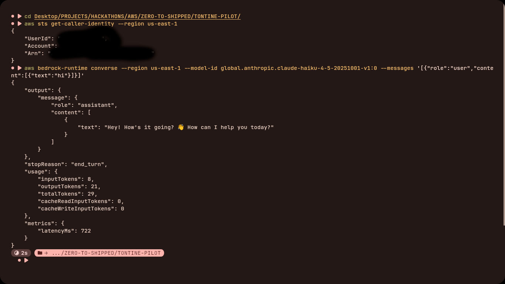
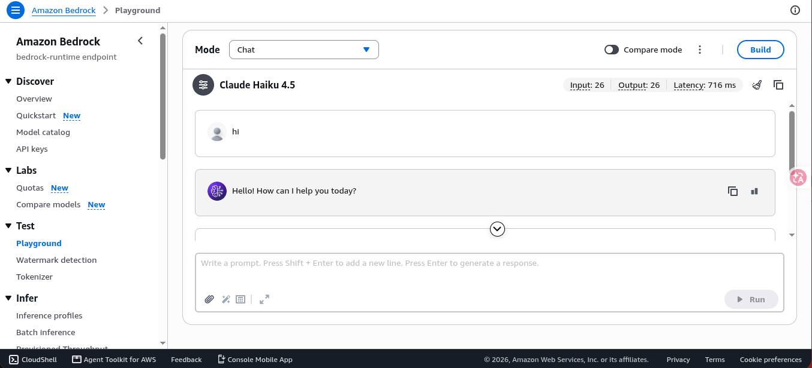
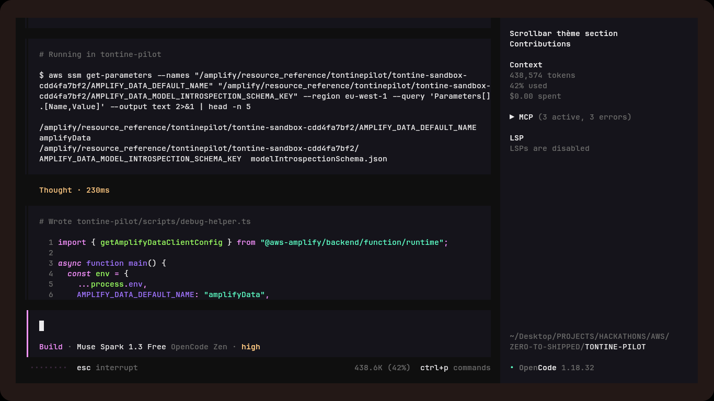

# Proof pack — TontinePilot ship gate

## Live URL
- Public URL: https://main.dhnfua5oyahpy.amplifyapp.com (Amplify Hosting, us-east-1)
- Verified: `curl` returns `200`.
- Mode: LIVE backend — sandbox outputs bundled in the build.
  /login serves the real Cognito flow, dashboard/alerts read live AppSync data.
- Check: `curl -s -o /dev/null -w "%{http_code}" <URL>` must print `200`

## Agent connection proof
- Coding agent used for the whole build (scaffold → backend → integration → ship).
- AWS access method: AWS CLI + `gh` CLI, both from the dev machine.
- Amplify sandbox deploys driven by the agent: `npx ampx sandbox --identifier tontine`
  (stack `amplify-tontinepilot-tontine-sandbox-*`, us-east-1).
- Backend proof: 8 Lambdas + EventBridge schedule `tontine-daily-reminders`
  (ENABLED), AppSync API, Cognito pool, S3 buckets — all created via agent-run commands.
- Live Bedrock verification: `scripts/verify.ts` 9/9 green against us-east-1
  (`us.anthropic.claude-haiku-4-5-20251001-v1:0`).

## Backend live (sandbox, us-east-1)
- AppSync + Cognito + 8 Lambdas + Scheduler `tontine-daily-reminders` (ENABLED).
- End-to-end proof: `scripts/verify.ts` 9/9 PASS against real Bedrock Haiku 4.5
  (ran 2026-09-25, zero FALLBACK lines in CloudWatch).
- Note: outputs are pinned to the sandbox stack — do not delete/recreate it
  before winners are announced (freeze per TASKS.md T-8).

## AWS services used
Cognito (email+password+code auth) · AppSync + DynamoDB (Amplify Data) ·
Lambda ×6 (Bedrock NLU, Vision OCR, mediation, rotation, Polly digest, reminders) ·
Bedrock Converse (Haiku 4.5, Sonnet 4.5) · S3 (receipts, digests) ·
EventBridge Scheduler (daily reminders) · SES + SNS (notifications) ·
Polly (Léa/Joanna audio digests) · Textract (OCR fallback) · Amplify Hosting.

## Judge login
- Demo user: `demo@tontinepilot.sn` (pre-confirmed, password in Builder Center private notes — never in repo)
- Language toggle FR/EN on every page.
